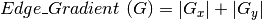

# opencv小白02学习笔记02
## OpenCV-Python教程:11.图片阈值
https://www.jianshu.com/p/267a32ad0a23

cv2阈值处理:https://blog.csdn.net/u011070767/article/details/80639556

一、全局阈值

为整个图片指定一个阈值，函数为cv2.threshold(src, thresh, maxval, type, dst=None)


```
src: 原图(灰图)  
thresh: 阈值  
maxval: 给#THRESH_BINARY and #THRESH_BINARY_INV模式使用的最大值  
 type：二值化的类型
cv2.THRESH_BINARY           超过阈值部分取maxval（最大值），否则取0
cv2.THRESH_BINARY_INV    THRESH_BINARY的反转
cv2.THRESH_TRUNC            大于阈值部分设为阈值，否则不变
cv2.THRESH_TOZERO          大于阈值部分不改变，否则设为0
cv2.THRESH_TOZERO_INV  THRESH_TOZERO的反转
```

二、自适应阈值

前面介绍的是全局性的阈值，整个图像的像素都以此阈值为基准。而自适应阈值可以看成是一种局部性的阈值，指定一个区域大小，此区域内的阈值为区域里面像素的平均值（或加权和）减去第六个参数C


```
adaptiveThreshold(src, maxValue, adaptiveMethod, thresholdType, blockSize, C, dst=None):
src：原图（灰图）
maxValue：像素值上限
adaptiveMethod：自适应方法
 cv2.ADAPTIVE_THRESH_MEAN_C ：领域内均值 
 cv2.ADAPTIVE_THRESH_GAUSSIAN_C ：领域内像素点加权和，权重为一个高斯窗口
thresholdType：只有两个cv2.THRESH_BINARY 和cv2.THRESH_BINARY_INV
blockSize： 规定正方形领域的大小
C：常熟C，阈值等于指定正方形领域的均值或加权和减去这个常熟
```


## OpenCV-Python教程:12.图片的几何转换
https://www.jianshu.com/p/1c6512d475cc

OpenCV提供了两个转换函数，cv2.warpAffine和cv2.warpPerspective,通过他们你可以进行各种转换，cv2.warpAffine接受2x3的转换矩阵二cv2.warpPerspective接受3x3的转换矩阵做为输入。

OpenCV有一个函数cv2.resize()来干这个，图片的大小可以人工指定，或者你可以指定缩放因子。有不同的差值方式可以使用，推荐的插值方法是缩小时用cv2.INTER_AREA，放大用cv2.INTER_CUBIC(慢)和cv2.INTER_LINEAR。默认情况下差值使用cv2.INTER_LINEAR


```

res = cv2.resize(img, None, fx=2, fy=2, interpolation=cv2.INTER_CUBIC)

#OR

height, width = img.shape[:2]

res = cv2.resize(img, (2*width, 2*height), interpolation=cv2.INTER_CUBIC)

```


平移是改变物体的位置。
你可以把它变成Numpy的数组，类型是np.float32的，然后把它传给cv2.warpAffine()函数


```

M = np.float32([[1,0,100],[0,1,50]])

dst = cv2.warpAffine(img, M, (cols,rows))

```


旋转

```

M = cv2.getRotationMatrix2D((cols/2,rows/2), 90, 1)

dst = cv2.warpAffine(img, M, (cols, rows))

```

仿射变换

```

M = cv2.getAffineTransform(pts1, pts2)

dst = cv2.warpAffine(img,M,(cols, rows))

```


透视变换

对于透视变换，你需要一个3x3的转换矩阵。转换后直线仍然保持直线

cv2.getPerspectiveTransform函数就能得到转换矩阵了，再用cv2.warpPerspective来接收这个3x3的转换矩阵。

```
pts1 = np.float32([[56,65],[368,52],[28,387],[389,390]])  
pts2 = np.float32([[0,0],[300,0],[0,300],[300,300]])  
M = cv2.getPerspectiveTransform(pts1,pts2)  
dst = cv2.warpPerspective(img, M,(300,300))  
```

## OpenCV-Python教程:13.平滑图片
https://www.jianshu.com/p/451c52a74ddb

```

kernel = np.ones((5,5), np.float32)/25

dst = cv2.filter2D(img, -1, kernel)

```

图片模糊(图片平滑）

1.平均

这个方法是用一个标准化的箱式过滤器来卷积。它简单的把核区域周围的像素的平均替换中心元素。

这个是用的cv2.blur()或者cv2.boxFilter()。

如果你不想用标准化箱式过滤器，使用cv2.boxFilter()然后传参数normalize=False给函数。

blur = cv2.blur(img,(5,5))

2.高斯滤波

在这个方法里，使用一个高斯核。函数是cv2.GaussianBlur()。

blur = cv2.GaussianBlur(img,(5,5),0)

3.中值滤波

这里函数cv2.medianBlur()计算核窗口下的所有像素的中值来替换中心像素点。这个特别适合去除椒盐噪点

在高斯和箱式过滤中，给中心点用的过滤的值可以是在原图中没有的值，但是在中值滤波中不同，因为中心元素总是被图片里的某个像素值替代。这个方法在去除噪音上很高效。核的大小必须是正奇数。

median = cv2.medianBlur(img,5)

4.双边滤波

我们之前展示过的滤波器都是倾向于模糊边界的。但是双边滤波不是这样，cv2.bilateralFilter()，在保持边界的情况下去除噪点非常有效。但是这个操作比其他滤波器都慢一些。

blur = cv2.bilateralFilter(img,9,75,75)


## OpenCV-Python教程:14.形态变换
https://www.jianshu.com/p/dcecaf62da71

1.腐蚀

腐蚀的基本理念就和土壤腐蚀一样，它会腐蚀掉前景的边缘（所以前景应该用白色）。

erosion = cv2.erode(img,kernel,iterations=1)

2.膨胀

这个就是腐蚀的反义词，在核下只要有至少一个像素是1，像素的值就是1.所以它会增加图片上白色区域的范围或者前景物体的大小。

dilation = cv2.dilate(img,kernel,iterations=1)

3.开

开就是腐蚀之后再膨胀的另一个名字。我们使用函数cv2.morphologyEx()

opening = cv2.morphologyEx(img,cv2.MORPH_OPEN,kernel)

4.闭

闭是开的反义词，膨胀之后再腐蚀，在用来关闭前景对象里的小洞或小黑点很有用。

closing = cv2.morphologyEx(img,cv2.MORPH_CLOSE,kernel)

5.形态梯度

这个和腐蚀以及膨胀不同，结果看上去像是物体的轮廓。

gradient = cv2.morphologyEx(img,cv2.MORPH_GRADIENT,kernel)

6.顶帽

这个是输入图片和图片的开运算结果的差别，下面是9x9的核的

tophat=cv2.morphologyEx(img,cv2.MORPH_TOPHAT,kernel)

7.黑帽

这是输入图片的闭的结果和输入图片的差别。

blackhat=cv2.morphologyEx(img,cv2.MORPH_BLACKHAT,kernel)


## OpenCV-Python教程:15.图片梯度
https://www.jianshu.com/p/e7d466446a06

图像梯度的基本原理：https://blog.csdn.net/saltriver/article/details/78987096，

当用均值滤波器降低图像噪声的时候，会带来图像模糊的副作用。我们当然希望看到的是清晰图像。那么，清晰图像和模糊图像之间的差别在哪里呢？从逻辑上考虑，图像模糊是因为图像中物体的轮廓不明显，轮廓边缘灰度变化不强烈，层次感不强造成的，那么反过来考虑，**轮廓边缘灰度变化明显些，层次感强些是不是图像就更清晰**些呢。

sobel算子，scharr算子，Laplacian算子:https://blog.csdn.net/naruhina/article/details/104710805


 


## OpenCV-Python教程:16.Canny边缘检测
https://www.jianshu.com/p/f91a7b8e5285

Canny 边缘检测是一个很流行的边缘检测算法。由John F.Canny在1986年开发。这是一个多步骤的算法。

```
1.降噪  
2.找到图片中的亮度梯度  
3.非最大值抑制  
4.滞后阈值  
```
OpenCV把所有这些放在一个函数里，edges = cv2.Canny(img,100,200)。我们来看看怎么用它，第一个参数是输入图片，第二个和第三个参数是我们的minVal 和maxVal。aperture_size参数是索贝尔核的大小，用来找图片的梯度。默认是3，最后一个参数是L2gradient，用来指定寻找梯度幅值的公式。如果为True，会使用上面提到的更准确的公式，否则会用下面这个函数，默认情况下为False:



## OpenCV-Python教程:17.图像金字塔
https://www.jianshu.com/p/a06e38691dca

处理一个图像的不同分辨率的图片。比如在**搜索图像里的某些元素的时候**，比如脸，我们并不确认目标在图片里的大小。在这种情况下，我们可能需要创建一系列的不同分辨率的图片来在其中寻找目标。这些不同分辨率的图片叫做图片金字塔（因为他们从小到大堆在一起的时候像个金字塔）
有两种图像金字塔1）高斯金字塔 2）拉普拉斯金字塔
**高斯金字塔的高级（低分辨率）是从低级别（高分辨率）的图像里移除连续的行和列来形成的**。高级别理的每个像素是下级5个高斯权重的像素得到的。
**拉普拉斯金字塔式从高斯金字塔得到的**，没有单独的函数。

```
img = cv2.imread('messi5.jpg')
lower_reso = cv2.pyrDown(higher_reso)
higher_reso2 = cv2.pyrUp(lower_reso)
```
## OpenCV-Python教程:18.图像轮廓
https://www.jianshu.com/p/4f790fb18691

轮廓可以被简单解释为一个**连接所有连续点的曲线（沿边界），有同样的颜色和亮度**。轮廓在做**形状分析和目标检测与识别**都很有用。
```
为了更好地额准确率，使用二进制图像，所以在找轮廓前，使用阈值或者canny边缘检测。
findContours函数修改原图。所以如果你想在找轮廓后还需要原图，把它存到别的变量里。
在OpenCV里，找轮廓和在黑色背景里找白色目标一样，所以记住，目标应该是白的而背景是黑色的。

im = cv2.imread('test.jpg')
imgray = cv2.cvtColor(im,cv2.COLOR_BGR2GRAY)
ret,thresh = cv2.threshold(imgray,127,255,0)
image, contours, hierarchy = cv2.findContours(thresh,cv2.RETR_TREE,cv2.CHAIN_APPROX_SIMPLE)
```
要绘制轮廓，可以用cv2.drawContours函数。如果你有图形的边界点，也可以用来绘制任何形状。

要画一个图像的所有轮廓：

```
img=cv2.drawContours(img,contours,-1,(0,255,0),3)
```
要画第四级轮廓：

```
img=cv2.drawContours(img,contours,3,(0,255,0),3)
```
但大多数时候，下面的更有用：

```
cnt=contours[4]img=cv2.drawContours(img,[cnt],0,(0,255,0),3)
```

Contour 近似方法

这是cv2.findContours函数的参数，它实际是指什么呢？

**轮廓是图形的边界。它存了边界坐标(x,y)**，但是它存了所有坐标么？这个就是轮廓近似方法指定的。

如果你传cv2.CHAIN_APPROX_NONE，所有的边界点都会存下来。但是实际上我们需要所有的点么？比如说，你发现一个直线的轮廓，你需要这线上的所有点来表示这个线么？不需要，我们只需要两个端点就够了。**这就是cv2.CHAIN_APPROX_SIMPLE要做的。它会去掉所有冗余点来压缩轮廓，节省内存。**


## OpenCV-Python教程:19.轮廓属性
https://www.jianshu.com/p/6bde79df3f9d

1图像矩

帮你计算一些属性，比如重心，面积等。

函数cv2.moments()会给你一个字典，包含所有矩值

2.轮廓面积

轮廓面积由函数cv2.contourArea()得到或者从矩里得到M['m00']

3.轮廓周长

可以用cv2.arcLength()函数得到。第二个参数指定形状是否是闭合的轮廓（如果传True）。或者只是一个曲线。

4.轮廓近似

这会把轮廓形状近似成别的边数少的形状，边数由我们指定的精确度决定。这是Douglas-Peucker算法的实现。

```
approx = cv2.approxPolyDP(cnt,epsilon,True)
```
5.凸形外壳

凸形外壳和轮廓近似类似，但是还不一样（某些情况下两个甚至提供了同样的结果）。

```
hull = cv2.convexHull(points[, hull[, clockwise[, returnPoints]]
```
6.检查凸面

有一个函数用来检查是否曲线是凸面, cv2.isContourConvex().它返回True或False。

```
k=cv2.isContourConvex(cnt)
```
7.边界矩形

有两种边界矩形

7.a.正边界矩形

```
x,y,w,h = cv2.boundingRect(cnt)
img = cv2.rectangle(img,(x,y),(x+w,y+h),(0,255,0),2)
```
7.b.渲染矩形

```
rect = cv2.minAreaRect(cnt)
box = cv2.boxPoints(rect)
box = np.int0(box)
im = cv2.drawContours(im,[box],0,(0,0,255),2)
```
这个边界矩形是用最小面积画出来的，所以要考虑旋转。函数是cv2.minAreaRect()。它返回一个Box2D结构，包含了(左上角(x,y)，（width, height）,旋转角度）。但是要画这个矩形我们需要4个角。这四个角用函数cv2.boxPoints()得到

8.最小闭包圆

我们找一个目标的外接圆可以用函数cv2.minEnclosingCircle().这个圆用最小面积完全包围目标。

```
(x,y),radius = cv2.minEnclosingCircle(cnt)
center = (int(x),int(y))
radius = int(radius)
img = cv2.circle(img,center,radius,(0,255,0),2)
```
9.椭圆

用一个椭圆来匹配目标。它返回一个旋转了的矩形的内接椭圆

```
ellipse=cv2.fitEllipse(cnt)
im=cv2.ellipse(im,ellipse,(0,255,0),2)
```
10. 直线

类似的我们可以匹配一根直线，下面的图像包含一系列的白色点，我们可以给它一条近似的直线。

```
rows,cols = img.shape[:2]
[vx,vy,x,y] = cv2.fitLine(cnt, cv2.DIST_L2,0,0.01,0.01)
lefty = int((-x*vy/vx) + y)
righty = int(((cols-x)*vy/vx)+y)
img = cv2.line(img,(cols-1,righty),(0,lefty),(0,255,0),2)
```
## OpenCV-Python教程:20.轮廓属性
https://www.jianshu.com/p/0d5d357840e6

我们要得到一些目标有用的属性，比如当量直径

1.高宽比

这是目标的边界矩形的宽高比

```
x,y,w,h=cv2.boundingRect(cnt)
aspect_ratio=float(w)/h
```
2.Extent

Extent是轮廓面积和边界矩形面积的比率

3.Solidity

是轮廓面积和凸形外壳面积的比率

4.等价半径

是面积和轮廓面积一样的圆的半径

```
area=cv2.contourArea(cnt)
equi_diameter=np.sqrt(4*area/np.pi)
```
5.方向

目标的方向角度。下面的方法可以得到长轴和短轴长度

```
(x,y),(MA,ma),angle=cv2.fitEllipse(cnt)
```
6.

在某些情况下，我们可能需要构成目标的所有点。

```
mask = np.zeros(imgray.shape,np.uint8)
cv2.drawContours(mask,[cnt],0,255,-1)
pixelpoints = np.transpose(np.nonzero(mask))
#pixelpoints = cv2.findNonZero(mask)
```
这里，两个方法，一个使用Numpy函数，另一个使用OpenCV函数（最后的注释行）达到同样目的。结果也是相同的。不同的一点是Numpy给的坐标是(row, column)格式，而OpenCV给的坐标是(x, y)格式，所以基本上结果可以互相转换。row = x ， column = y

7.最大值，最小值以及他们的位置

```
min_val,max_val,min_loc,max_loc=cv2.minMaxLoc(imgray,mask=mask)
```
8.平均颜色和平均强度

我们可以得到目标的平均颜色。或者是灰度模式下的平均亮度。再次使用了mask image

```
mean_val=cv2.mean(im,mask=mask)
```
9.端点

端点表示最高点，最低点，最左和最右点。

```
leftmost = tuple(cnt[cnt[:,:,0].argmin()][0])
rightmost=tuple(cnt[cnt[:,:,0].argmax()][0])
topmost=tuple(cnt[cnt[:,:,1].argmin()][0])
bottommost=tuple(cnt[cnt[:,:,1].argmax()][0])
```
