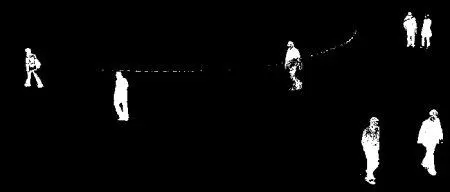

# opencv小白05学习笔记05
## OpenCV-Python教程:40.ORB
https://www.jianshu.com/p/49a84ddef11d

ORB最重要的事情是它是OpenCV实验室出来的，它在计算成本，匹配性能上是SIFT和SURF很好的替代品，还有最主要的，专利，对，**SIFT和SURF都是有专利的，你得付费试用，但是ORB不是。**

ORB基本上是一个FAST关键点检测和BRIEF描述子的融合，同时做了很多修改提高了性能。**首先它使用FAST来找关键点，然后用Harris角点测量来找到头N个点。还使用金字塔来产生多层级特征**，但是问题是FAST不计算方向，所以旋转不变呢？作者做了如下修改。

## OpenCV-Python教程:41.特征匹配
https://www.jianshu.com/p/ed57ee1056ab

Brute-Force匹配器很简单，它取第一个集合里一个特征的描述子并用第二个集合里所有其他的特征和他通过一些距离计算进行匹配。最近的返回。

用cv2.BFMatcher()创建BF匹配器对象.它取两个可选参数，第一个是normType。它指定要使用的距离量度。默认是cv2.NORM_L2。对于SIFT,SURF很好。（还有cv2.NORM_L1）。对于二进制字符串的描述子，比如ORB，BRIEF，BRISK等，应该用cv2.NORM_HAMMING。使用Hamming距离度量，如果ORB使用VTA_K == 3或者4，应该用cv2.NORM_HAMMING2

第二个参数是布尔变量，crossCheck模式是false，如果它是true，匹配器返回那些和(i, j)匹配的，这样集合A里的第i个描述子和集合B里的第j个描述子最匹配。两个集合里的两个特征应该互相匹配，它提供了连续的结果，

匹配方法：BFMatcher.match()和BFMatcher.knnMatch()。第一个返回最匹配的，第二个方法返回k个最匹配的，k由用户指定。当我们需要多个的时候很有用。

匹配结果绘图：想我们用cv2.drawKeypoints()来画关键点一样，cv2.drawMatches()帮我们画匹配的结果，它把两个图像水平堆叠并且从第一个图像画线到第二个图像来显示匹配。还有一个cv2.drawMatchesKnn来画k个最匹配的。如果k=2，它会给每个关键点画两根匹配线。所以我们得传一个掩图，如果我们想选择性的画的话。


## OpenCV-Python教程:42.特征匹配+Homography找目标
https://www.jianshu.com/p/d835f1a4717c

使用一个calib3d模块里的函数，cv2.findHomography().如果我们传了两个图像里的点集合，它会找到那个目标的透视转换。然后我们可以使用cv2.perspectiveTransform()来找目标，它需要至少4个正确的点来找变换。

我们看过可能会有一些匹配是的错误而影响结果。哟啊解决这个问题，算法使用了RANSAC或者LEAST_MEDIAN（由标志决定）。提供正确估计的好的匹配被叫做inliers，而其他的叫做outliers。cv2.findHomography()返回一个掩图来指定inlier和outlier。

## OpenCV-Python教程:43.meanshift和camshift
https://www.jianshu.com/p/4de0facae74a


## OpenCV-Python教程:44.光流
https://www.jianshu.com/p/87934b0cdd65

光流是**物体或者摄像头的运动导致的两个连续帧之间的图像对象的视觉运动的模式**。它是一个向量场，**每个向量是一个位移矢量**，显示了从第一帧到第二帧的点的移动。

光流在很多领域有应用：

```
·从移动构建  
·视频压缩  
·视频稳定  
```
光流在很多假设下有效：

```
物体像素强度在连续帧之间不变化  
邻居像素有相似运动  
```
OpenCV通过函数cv2.calcOpticalFlowPyrLK()提供了所有这些。这里，我们创建一个简单的应用来跟踪视频里的一些点。我们用cv2.goodFeaturesToTrack()来决定点。先取第一帧，检测一些Shi-Tomasi角点，然后我们用Lucas-Kanade光流法迭代跟踪那些点。对于函数cv2.calcOpticalFlowPyrLK()我们传前一帧，前面的那些点和下一帧。它会返回下一帧的点和一些状态值，如果下一次的点被找到了这些值就为1，如果没找到就是0.我们在下一步把这些点再作为上一次的点传进去继续迭代。

OpenCV里的密集光流

Lucas-Kanade方法计算稀疏特征集的光流（在我们的例子里，角点检测使用Shi-Tomasi算法）。OpenCV提供了另一个算法来找密集光流。它计算帧里的所有点的光流。它基于Gunner Farneback的算法。


## OpenCV-Python教程:45.背景去除
https://www.jianshu.com/p/a8a9bc22ebca

OpenCV实现了三个这样的算法，很易用，我们一个个看一下。

BackgroundSubtractorMOG



BackgroundSubtractorMOG2

BackgroundSubtractorGMG


## OpenCV-Python教程:46.摄像头标定
https://www.jianshu.com/p/df78749b4318


## OpenCV-Python教程:47.姿态估计
https://www.jianshu.com/p/fb4e574f5574


## OpenCV-Python教程:48.核面几何
https://www.jianshu.com/p/0ddde4b7730f


## OpenCV-Python教程:49.立体图像的深度图
https://www.jianshu.com/p/4a31a3d883f1

