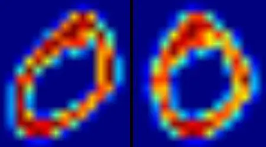
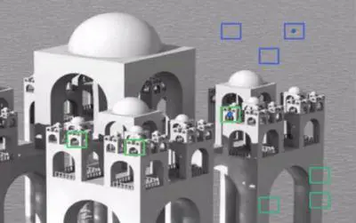
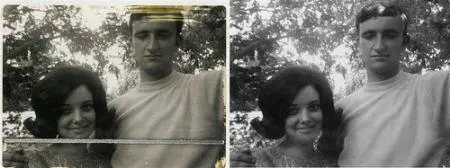
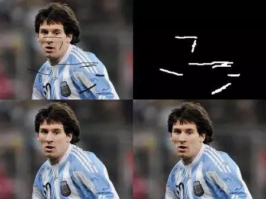
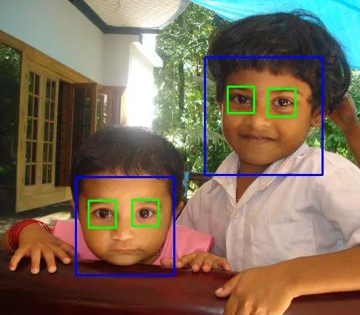

# opencv小白06学习笔记06
## OpenCV-Python教程:50.理解k-近邻
https://www.jianshu.com/p/404e329e4e80  
OpenCV里的kNN  
```
newcomer = np.random.randint(0,100,(1,2)).astype(np.float32)
plt.scatter(newcomer[:,0],newcomer[:,1],80,'g','o')

knn = cv2.KNearest()
knn.train(trainData,responses)
ret, results, neighbours ,dist = knn.find_nearest(newcomer, 3)
```
## OpenCV-Python教程:51.使用kNN做手写数据OCR
https://www.jianshu.com/p/af02293c5a7e  
```
knn = cv2.KNearest()
knn.train(train,train_labels)
ret,result,neighbours,dist = knn.find_nearest(test,k=5)
```
## OpenCV-Python教程:52.理解SVM
https://www.jianshu.com/p/03cfa441ca64  

## OpenCV-Python教程:53.使用SVM进行手写数据的OCR
https://www.jianshu.com/p/0fd323eb0a99  

使用图像的二阶矩模型来抗色偏。所以我们首先定义一个函数deskew()取一个数字图像并对他抗色偏。下面是deskew()函数：
```
def deskew(img):
    m = cv2.moments(img)
    if abs(m['mu02']) < 1e-2:
        return img.copy()
    skew = m['mu11']/m['mu02']
    M = np.float32([[1, skew, -0.5*SZ*skew], [0, 1, 0]])
    img = cv2.warpAffine(img,M,(SZ, SZ),flags=affine_flags)
    return img
```
  

```
svm = cv2.SVM()
svm.train(trainData,responses, params=svm_params)
svm.save('svm_data.dat')

######    Now testing      ########################

deskewed = [map(deskew,row) for row in test_cells]
hogdata = [map(hog,row) for row in deskewed]
testData = np.float32(hogdata).reshape(-1,bin_n*4)
result = svm.predict_all(testData)
```

## OpenCV-Python教程:54.K-Means集群
https://www.jianshu.com/p/53a1ae1651c0  
## OpenCV-Python教程:55.OpenCV里的K-Means聚类
https://www.jianshu.com/p/b24086aab3fc  
## OpenCV-Python教程:56.图像去噪
https://www.jianshu.com/p/26e29adf7429  
保持一个静止的摄像机对准一个位置多呆几秒，这会给你很多帧，或者是对一个场景的很多图像。然后写一些代码来找到视频里所有帧的平均值。比较最终的结果和第一帧。你可以看到噪点被去掉了。不幸的是这个简单的方法对于摄像机和场景的运动来说就不健壮了。而且经常你也只有一个噪音图像可用。  
所以思路很简单，我们需要一套类似的图像来平均去掉噪点，假设图像上一个小窗口（比如5x5的窗口）。很有可能在图像里的某处还有一个相同的块。有时候是在它附近的邻居。用这样类似的块来做他们的平均会怎么样呢？对于这个特定的窗口，看下面的例子：
  
对于彩色图像，图像先要转换成CIELAB颜色空间然后再分成L去噪和AB部分。  
OpenCV里的图像去噪  
OpenCV提供了这个技术的四个变形：  
```
1.cv2.fastNlMeansDenoising() - 对于一个灰度图像的
2.cv2.fastNlMeansDenoisingColored() - 对于彩色图像的
3.cv2.fastNlMeansDenoisingMulti() - 对于短时间内拍摄的一序列图像的(灰度图像）
4.cv2.fastNlMeansDenoisingColoredMulti() - 和上面一眼个，不过是彩色图像。
```
通用参数如下：  
```
·h: 决定过滤器强度的参数。更高的h值能够更好去噪，但是会去掉更多图像细节(10就ok）
·hForColorComponents: 和h一样，不过只是针对彩色图像的（一般和h一样）
·templateWindowSize：应该是奇数(推荐7）
·searchWindowSize：应该是奇数(推荐21）
```

## OpenCV-Python教程:57.图像修复
https://www.jianshu.com/p/af5beb643d38  
一些老照片已经有黑点啊，划痕啊等。你有想过修复它们么？我们不能简单的在绘图工具里把他们擦除了就完了。因为这样只是把黑色的东西变成白色的而已，实际上没用。在这种情况下，会用到一种技术叫图像修复。基本的思想很简单：用周围的像素替换坏掉的像素，这样看上去就和周围一样了。  
  
OpenCV提供了两个，可以用同一个函数来访问: cv2.inpaint()  
编码  
我们需要创建和输入图像相同大小的掩图，需要修复的区域对应的像素要非0.剩下的就简单了。我的图像被一些黑色划痕给破坏了(实际上是我自己加的)。我用绘图工具对应的标记出来。  
```
import numpy as np
import cv2

img = cv2.imread('messi_2.jpg')
mask = cv2.imread('mask2.png',0)

dst = cv2.inpaint(img,mask,3,cv2.INPAINT_TELEA)

cv2.imshow('dst',dst)
cv2.waitKey(0)
cv2.destroyAllWindows()
```
看下面的结果。第一个图片是输入图像，第二个是掩图，第三个是用第一种算法的结果，最后一张是第二种算法的结果。  
  

## OpenCV-Python教程:58.使用Haar Cascades面部识别
https://www.jianshu.com/p/e5f18ef0e5a8  
OpenCV里的Haar-cascade检测  
OpenCV提供了检测器和训练器。如果你想训练你自己的分类器来识别诸如汽车啊，飞机什么的，你可以使用OpenCV来创建一个。详细内容见：[Cascade Classifier Training](https://docs.opencv.org/2.4/doc/user_guide/ug_traincascade.html)  
这里我们只看检测器，OpenCV已经包含了很多训练过的分类器，面部的，眼睛的，笑容的等。那些XML文件存在opencv/data/haarcascades/目录。让我们创建一张脸和眼的检测器吧。  
首先我们需要加载必须的XML分类器，然后用灰度模式加载我们的输入图像（或者视频）。   
```
face_cascade = cv2.CascadeClassifier('haarcascade_frontalface_default.xml')
eye_cascade = cv2.CascadeClassifier('haarcascade_eye.xml')

img = cv2.imread('sachin.jpg')
gray = cv2.cvtColor(img, cv2.COLOR_BGR2GRAY)
```
现在我们在图像里找到脸。如果找到脸，它会返回检测到的脸的位置(x, y, w,h）。当我们得到这些位置，我们可以为脸创建一个ROI然后在这个ROI上应用眼睛检测（因为眼睛总是在脸上的！）  
```
faces = face_cascade.detectMultiScale(gray, 1.3, 5)
for (x,y,w,h) in faces:
    img = cv2.rectangle(img,(x,y),(x+w,y+h),(255,0,0),2)
    roi_gray = gray[y:y+h, x:x+w]
    roi_color = img[y:y+h, x:x+w]
    eyes = eye_cascade.detectMultiScale(roi_gray)
    for (ex,ey,ew,eh) in eyes:
        cv2.rectangle(roi_color,(ex,ey),(ex+ew,ey+eh),(0,255,0),2)

cv2.imshow('img',img)
cv2.waitKey(0)
cv2.destroyAllWindows()
```
  

## OpenCV-Python教程:59.OpenCV-Python 是如何工作的
https://www.jianshu.com/p/f17ee7a100ef  
python调用c简介  

## OpenCV-Python教程:60.scikit-learn
https://www.jianshu.com/p/aedaec60f67b  
scikit-learn简介，scikit-learn每个数据挖掘专业必备入门工具，没啥可说的，深度学习火之前大家都是靠scikit-learn过日子的   


## OpenCV-Python教程:61.一元线性回归
https://www.jianshu.com/p/1710ded8ff84   
使用python的matlibplot画图，体现一元线性回归的相关性关系。  

